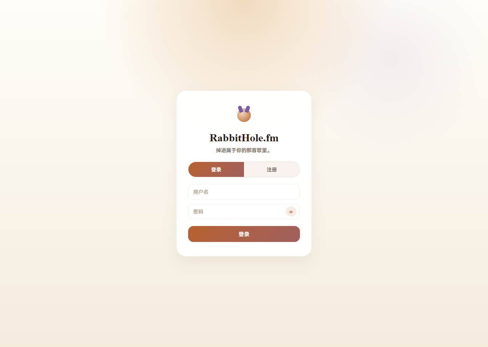
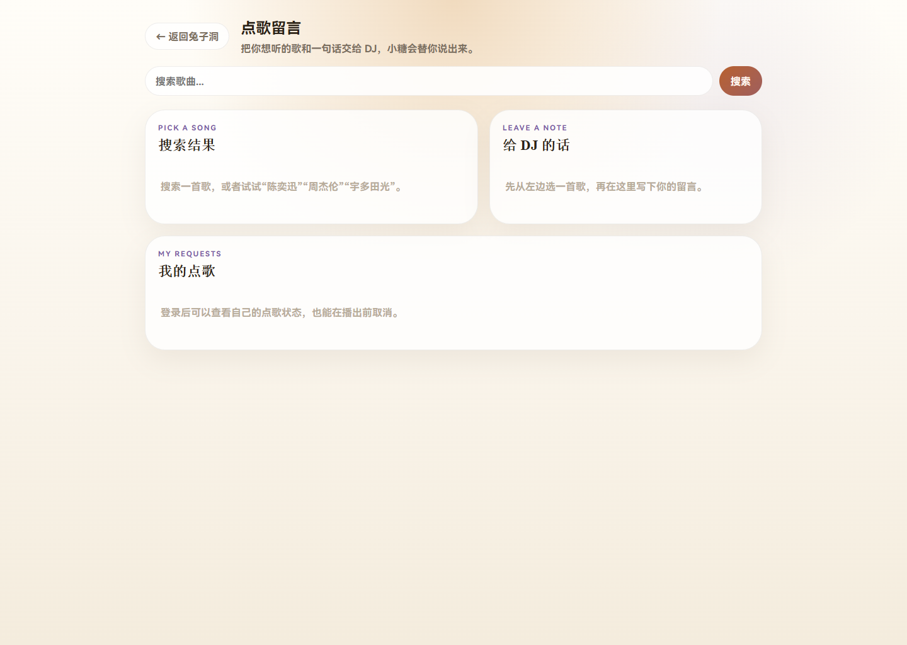
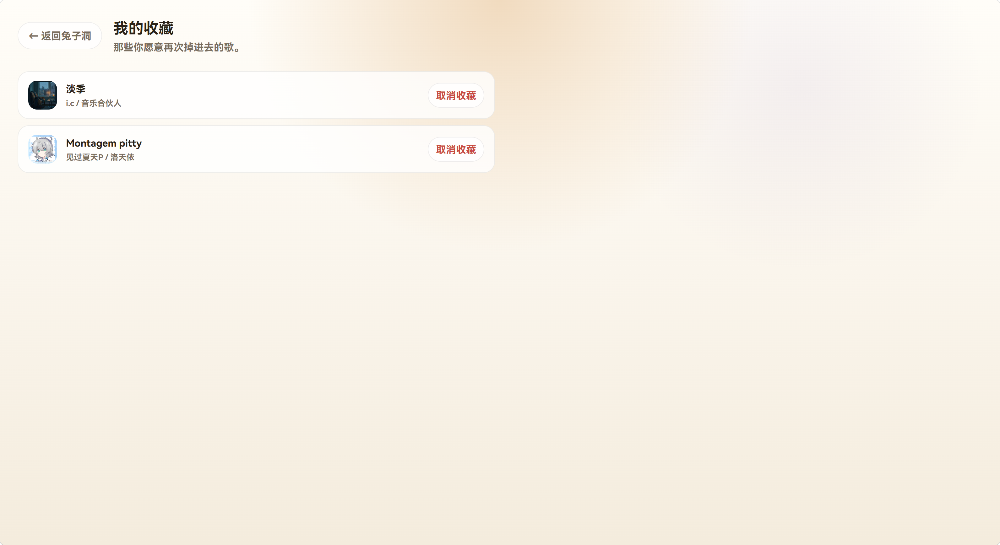
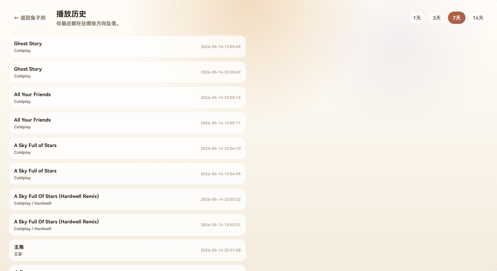
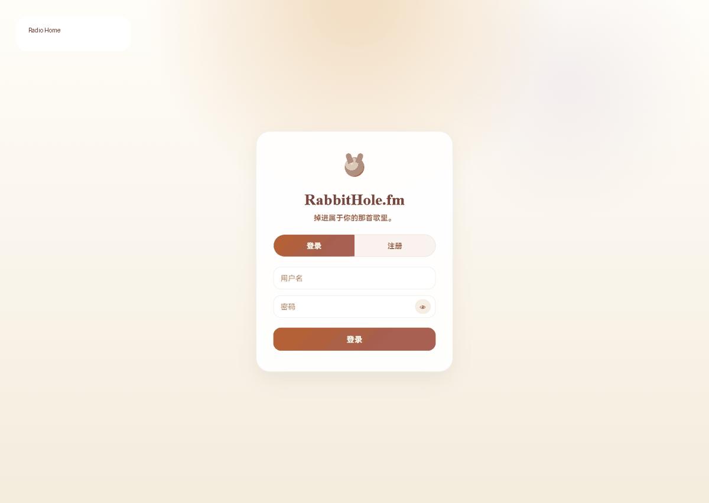
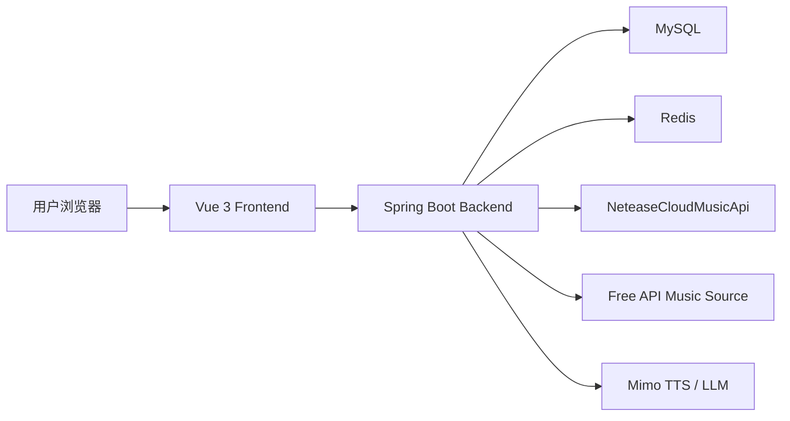

# RabbitHole.fm


RabbitHole.fm 是一个桌面优先的沉浸式 Web 音乐电台客户端，结合了网易云音乐歌单频道、外部音乐源搜索、房间点歌、个人歌单、收藏历史和可选 AI DJ 点歌口播。项目采用前后端分离架构，前端基于 Vue 3 + Vite，后端基于 Spring Boot 3，目标是提供接近桌面音乐软件的连续播放、队列管理与互动点歌体验。

[English](./README_EN.md)


## 目录

- [项目亮点](#项目亮点)
- [技术栈](#技术栈)
- [系统架构](#系统架构)
- [项目结构](#项目结构)
- [快速开始](#快速开始)
- [核心模块](#核心模块)
- [部署说明](#部署说明)
- [注意事项](#注意事项)
- [License](#license)

## 项目亮点

- 桌面音乐客户端布局：左侧电台/资料库，中间 Now Playing 与歌词主舞台，右侧点歌队列，底部常驻播放器
- 电台式连续播放：按频道加载播放队列，支持智能续播、键盘控制、进度与音量控制
- 可选择音乐源：搜索支持 `全部来源`、`网易云`、`Free API`，并保留来源标识、收藏与点歌兼容
- 房间点歌互动：支持二维码分享房间、点歌留言、个人点歌记录、取消点歌和点歌队列同步
- 可选 DJ 点歌口播：普通频道不再自动插入口播；点歌口播失败或超时会自动跳过，优先保证音乐不断播
- 队列与歌单能力：支持队列置顶/稍后播放、个人歌单、拖拽排序、加入歌单和迷你播放器
- 用户能力：支持注册、登录、收藏歌曲、收藏频道、播放历史记录与头像上传

## 界面展示

### 电台主页预览


### 登录页



### 点歌页



### 收藏页



### 历史页



这些截图均来自本地运行中的真实页面，用于更直观地展示项目的界面风格与核心交互流程。当前 UI 已升级为桌面优先的三栏音乐客户端，实际界面可能比早期截图更偏专业音乐控制台风格。

## 演示视频 / GIF



上面的 GIF 用于快速浏览首页、登录页和点歌页的主要视觉风格。如果后续你希望展示更完整的动态交互，也可以继续替换为更长的录屏或压缩视频。

## 技术栈

- 前端：Vue 3、Vite、Vue Router、Pinia、Axios
- 后端：Spring Boot 3、Spring Security、MyBatis-Plus、Redis、OkHttp、JWT
- 数据库：MySQL
- 外部能力：NeteaseCloudMusicApi、Free API 音乐源、小米 Mimo TTS / LLM

## 系统架构



## 项目结构

```text
RabbitHole.fm/
├─ backend/                 Spring Boot 后端
├─ frontend/                Vue 3 前端
├─ sql/                     数据库初始化脚本
├─ doc/                     开发过程文档
├─ NeteaseCloudMusicApi/    第三方接口相关目录
├─ docker-compose.yml       Redis / 网易云接口辅助服务
├─ start-netease-api.bat    Windows 启动网易云接口脚本
└─ README_EN.md             英文说明
```

## 快速开始

### 环境要求

- JDK 17
- Maven 3.9+
- Node.js 18+
- MySQL 8.x
- Redis 7.x

### 1. 初始化数据库

执行 [sql/init.sql](./sql/init.sql) 创建项目所需表结构。

### 2. 配置后端

后端配置文件位于 [backend/src/main/resources/application.yml](./backend/src/main/resources/application.yml)。

默认配置包括：

- 服务端口：`8080`
- MySQL 地址：`jdbc:mysql://127.0.0.1:3306/RabbitHole.fm`
- Redis 地址：`127.0.0.1:6379`
- 网易云接口地址：`http://127.0.0.1:3000`
- Free API 音乐源：默认启用，搜索地址为 `https://api.apiopen.top/searchMusic`
- Mimo API Key：从环境变量 `MIMO_API_KEY` 读取
- DJ 口播策略：默认不自动插入口播，只保留房间点歌口播增强

如果你的本地数据库、Redis 密码或第三方接口配置不同，请按需修改。

### 3. 启动依赖服务

使用 Docker Compose 启动 Redis 和网易云接口：

```bash
docker compose up -d
```

也可以单独启动网易云接口：

```bash
npx NeteaseCloudMusicApi
```

仓库内提供了 [start-netease-api.bat](./start-netease-api.bat) 作为 Windows 启动脚本参考。

### 4. 启动后端

```bash
cd backend
mvn spring-boot:run
```

### 5. 启动前端

```bash
cd frontend
npm install
npm run dev
```

前端开发服务器默认通过 Vite 代理将 `/api` 和 `/avatars` 请求转发到 `http://localhost:8080`。

## 核心模块

- `/api/user`：注册、登录、资料、头像、收藏、历史
- `/api/music`：多源搜索、查询歌曲详情、封面代理、接口状态
- `/api/radio`：频道加载、下一首获取、可选 DJ 点歌口播
- `/api/request`：点歌、取消点歌、个人点歌记录、频道点歌队列
- `/api/tts`：文本转语音测试与合成

## 接口示例

### 用户登录

```bash
curl -X POST http://localhost:8080/api/user/login \
  -H "Content-Type: application/json" \
  -d "{\"username\":\"demo\",\"password\":\"123456\"}"
```

示例响应：

```json
{
  "code": 0,
  "msg": "登录成功",
  "token": "your-jwt-token"
}
```

### 搜索歌曲

```bash
curl "http://localhost:8080/api/music/search?keywords=Jay&limit=10&source=all"
```

`source` 可选值：

- `all`：聚合搜索，默认值
- `netease`：只搜索网易云
- `free-api`：只搜索 Free API

### 提交点歌

```bash
curl -X POST http://localhost:8080/api/request \
  -H "Authorization: Bearer your-jwt-token" \
  -H "Content-Type: application/json" \
  -d "{\"channelId\":32953014,\"songId\":2608813267,\"source\":\"netease\",\"sourceSongId\":\"2608813267\",\"message\":\"这首送给深夜还在写代码的人\"}"
```

### 获取频道播放列表

```bash
curl "http://localhost:8080/api/radio/channel/19723756"
```

### DJ 点歌口播

```bash
curl -i "http://localhost:8080/api/radio/dj?nextId=2608813267&requester=Rabbit&message=送给还在写代码的人"
```

DJ 口播是可选增强能力。TTS 服务不可用、响应为空或超时时，接口会返回可识别的跳过状态，前端会直接继续播放下一首音乐。

## 测试与验证

常用检查命令：

```bash
cd frontend
npm run build
npx playwright test e2e/rabbithole-smoke.spec.js --reporter=line
```

```bash
cd backend
mvn -DskipTests package
```

```bash
git diff --check
```

## 后续可扩展方向

- 接入真实在线演示地址与生产环境部署说明
- 补充更多真实页面截图，例如个人中心页
- 增加测试说明、常见问题和版本迭代记录
- 增加更多可配置音乐源，并完善来源健康状态展示
- 将 DJ 口播扩展为后台异步预生成与缓存机制

## 部署说明

- 前端可通过 `npm run build` 生成静态资源后部署到 Nginx 等静态服务器
- 后端可通过 Maven 打包后独立运行
- 若需完整功能，部署时需同时保证 MySQL、Redis、网易云接口服务和 Mimo API 可用

## 注意事项

- 当前 [backend/src/main/resources/application.yml](./backend/src/main/resources/application.yml) 中包含示例数据库账号、Redis 密码和 JWT 配置，正式部署前建议替换为你自己的安全配置
- 网易云音乐相关接口依赖第三方服务，稳定性与可用性受其运行状态影响
- 外部音乐源搜索结果必须包含可播放直链，才可用于点歌或直接播放
- 若未配置 `MIMO_API_KEY`，DJ 口播与 TTS 相关能力会自动降级；普通音乐播放不应被阻塞

## License

本项目使用 [LICENSE](./LICENSE) 中定义的许可协议。
