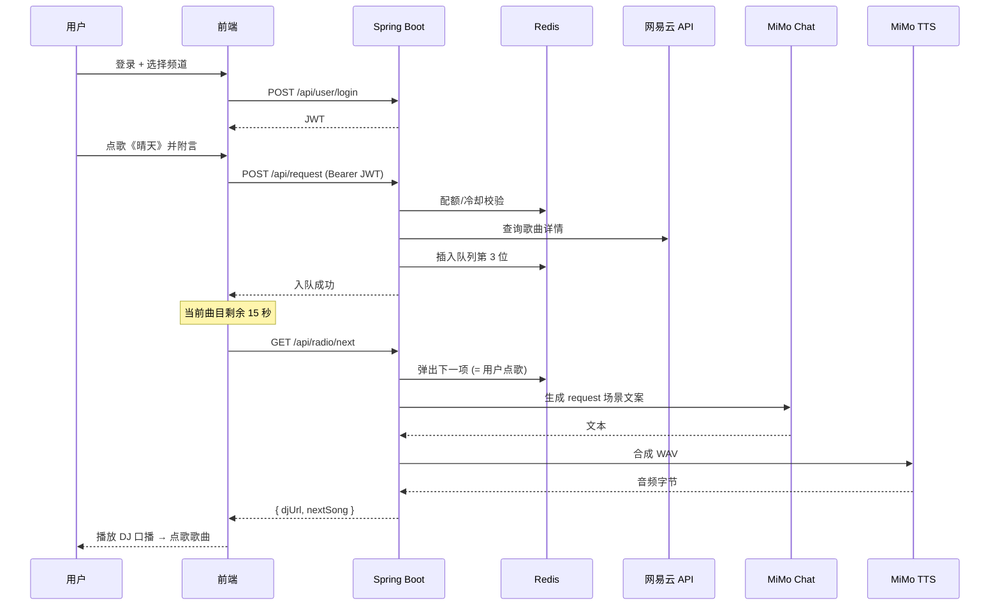

# 音乐电台网站开发文档

> 项目代号：\*\*JavaRadio\*\*  
> 技术栈：Java 17 + Spring Boot 3.x + NeteaseCloudMusicApi-Enhanced + 小米 MiMo TTS (mimo-v2.5-tts)  
> 文档版本：v1.0（2026-05）

\---

## 一、项目概述

### 1.1 项目目标

构建一个 Web 端音乐电台网站，核心能力包括：

* 通过网易云音乐 API 检索歌曲、获取歌单、解析音频直链、加载歌词；
* 通过小米 MiMo TTS（限时免费）生成"DJ 口播"音频，串联在歌曲之间，模拟真实电台播报；
* 支持频道（Channel）化的播放列表组织、自动顺播、手动切歌、同步歌词显示。

### 1.2 整体架构

```
┌─────────────────────────────────────────────────────────────┐
│                        前端 (Vue3 / 原生 H5)                 │
│   播放器 UI │ 歌词面板 │ 频道选择 │ DJ 口播波形展示          │
└─────────────────────┬───────────────────────────────────────┘
                      │ REST / SSE
┌─────────────────────▼───────────────────────────────────────┐
│            Spring Boot 后端 (本项目核心)                     │
│  ┌─────────────┐ ┌──────────────┐ ┌──────────────────────┐  │
│  │ MusicService│ │ TTSService   │ │ RadioPlaylistService │  │
│  └──────┬──────┘ └──────┬───────┘ └──────────┬───────────┘  │
│         │               │                    │              │
│   Redis 缓存 (歌曲直链 / 歌词 / TTS 音频字节)                │
└─────────┬───────────────┬────────────────────┬──────────────┘
          │               │                    │
   ┌──────▼──────┐  ┌─────▼────────┐    ┌──────▼─────────┐
   │ 网易云 API   │  │ MiMo TTS     │    │ 对象存储 (可选)│
   │ (本地或远端) │  │ 开放平台     │    │ MinIO / OSS    │
   └─────────────┘  └──────────────┘    └────────────────┘
```

### 1.3 核心业务流程

1. 用户进入频道 → 后端从该频道的歌单 ID 拉取歌曲列表；
2. 当前曲目播放进入末尾 N 秒时，后端根据"上一首 + 下一首"的元信息动态生成 DJ 口播文案；
3. 文案通过 MiMo TTS 合成 WAV 音频并缓存；
4. 前端按"歌曲 → DJ 口播 → 歌曲"的顺序无缝衔接播放，配合实时歌词渲染。

\---

## 二、环境与依赖

### 2.1 基础环境

|组件|版本|说明|
|-|-|-|
|JDK|17+|推荐 Eclipse Temurin|
|Maven|3.8+|构建工具|
|Spring Boot|3.2.x|主框架|
|Redis|7.x|缓存歌曲直链、TTS 音频|
|Node.js|16+|运行 NeteaseCloudMusicApi|
|MySQL（可选）|8.x|频道、用户、播放历史持久化|

### 2.2 关键依赖（pom.xml）

```xml
<dependencies>
    <dependency>
        <groupId>org.springframework.boot</groupId>
        <artifactId>spring-boot-starter-web</artifactId>
    </dependency>
    <dependency>
        <groupId>org.springframework.boot</groupId>
        <artifactId>spring-boot-starter-webflux</artifactId>
    </dependency>
    <dependency>
        <groupId>org.springframework.boot</groupId>
        <artifactId>spring-boot-starter-data-redis</artifactId>
    </dependency>
    <dependency>
        <groupId>com.fasterxml.jackson.core</groupId>
        <artifactId>jackson-databind</artifactId>
    </dependency>
    <dependency>
        <groupId>org.projectlombok</groupId>
        <artifactId>lombok</artifactId>
        <optional>true</optional>
    </dependency>
    <dependency>
        <groupId>com.squareup.okhttp3</groupId>
        <artifactId>okhttp</artifactId>
        <version>4.12.0</version>
    </dependency>
</dependencies>
```

\---

## 三、网易云音乐 API（NeteaseCloudMusicApi-Enhanced）部署

本项目**不直接对接网易官方加密接口**，而是通过 Binaryify 开源的 Node 服务做反向代理，本地启一个 HTTP 服务，Java 后端只需当作普通 REST 调用即可。

### 3.1 部署步骤

```bash
# 1. 拉取仓库（推荐 enhanced 增强版分支或最新版）
git clone https://github.com/Binaryify/NeteaseCloudMusicApi.git
cd NeteaseCloudMusicApi

# 2. 安装依赖
npm install
# 或使用 bun（更快）
bunx NeteaseCloudMusicApi@latest

# 3. 启动（默认端口 3000）
node app.js
# 自定义端口
PORT=4000 node app.js
```

### 3.2 推荐用 Docker Compose（生产环境）

```yaml
version: "3.8"
services:
  netease-api:
    image: oven/bun:alpine
    container\_name: netease-api
    command: bunx NeteaseCloudMusicApi@latest
    ports:
      - "3000:3000"
    environment:
      - PORT=3000
    restart: unless-stopped
```

### 3.3 本项目使用的核心接口清单

|用途|接口|关键参数|
|-|-|-|
|搜索歌曲|`GET /search`|`keywords`, `limit`, `type=1`|
|歌单详情|`GET /playlist/detail`|`id`|
|歌单全部歌曲|`GET /playlist/track/all`|`id`, `limit`, `offset`|
|歌曲详情|`GET /song/detail`|`ids`（逗号分隔）|
|获取播放直链|`GET /song/url/v1`|`id`, `level=standard\|exhigh\|lossless`|
|获取歌词|`GET /lyric`|`id`|
|每日推荐|`GET /recommend/songs`|需登录 cookie|
|个性化电台|`GET /personal\_fm`|需登录 cookie|

> \*\*注意\*\*：`/song/url/v1` 返回的 `url` 字段有时效性（通常 20 分钟），后端必须做缓存 + 失效后重新请求的策略。完整接口文档参考 \[NeteaseCloudMusicApi](https://github.com/Binaryify/NeteaseCloudMusicApi)。

\---

## 四、小米 MiMo TTS 接入

### 4.1 申请 API Key

1. 访问 [Xiaomi MiMo 开放平台](https://platform.xiaomimimo.com)；
2. 注册并完成实名认证（国内用户必填）；
3. 在控制台 → API 管理 中创建一个 API Key，记录为 `MIMO\_API\_KEY`；
4. 注意限时免费政策：MiMo-V2.5-TTS / MiMo-V2.5-ASR 当前为限时免费，正式收费前请关注官方公告。

### 4.2 接口规范（v2.5-tts）

* **Endpoint**：`POST https://api.xiaomimimo.com/v1/chat/completions`
* **请求头**：

  * `api-key: $MIMO\_API\_KEY`
  * `Content-Type: application/json`
* **请求体核心字段**：

  * `model`：固定为 `mimo-v2.5-tts`（预置音色）或 `mimo-v2.5-tts-voicedesign`（自定义音色）
  * `messages`：数组，`user` 角色描述风格、`assistant` 角色填要朗读的文本
  * `audio.format`：`wav` 或 `pcm16`（流式拼接用 pcm16）
  * `audio.voice`：预置音色（如 `冰糖`/`茉莉`/`苏打`/`白桦`/`Mia`/`Chloe`/`Milo`/`Dean`）

### 4.3 请求示例（Curl）

```bash
curl --location --request POST 'https://api.xiaomimimo.com/v1/chat/completions' \\
--header "api-key: $MIMO\_API\_KEY" \\
--header 'Content-Type: application/json' \\
--data-raw '{
    "model": "mimo-v2.5-tts",
    "messages": \[
        {"role": "user", "content": "用温柔甜美的女声播报，节奏轻快，像深夜电台 DJ。"},
        {"role": "assistant", "content": "(台湾腔)欢迎回到 JavaRadio 深夜频道，下一首为你带来周杰伦的《晴天》。"}
    ],
    "audio": {
        "format": "wav",
        "voice": "冰糖"
    }
}'
```

### 4.4 响应结构

返回标准 OpenAI Chat Completion 格式，音频 base64 位于 `choices\[0].message.audio.data`，需要 base64 解码后写入 `.wav` 文件或直接以 `audio/wav` 流回传给前端。

### 4.5 风格控制技巧

* **音频标签**：在 `assistant` 文本开头使用 `(开心)`、`(粤语)`、`\[悄悄话]`、`(东北话 变快)` 等标签；
* **​`<style>` 标签**：`<style>唱歌</style>歌词内容` 可以触发歌唱模式；
* **细粒度情绪**：可在文本中插入 `（深呼吸）`、`（轻笑）`、`（叹气）` 等，增强电台真实感。

\---

## 五、后端工程结构

```
javaradio/
├── src/main/java/com/javaradio/
│   ├── JavaRadioApplication.java
│   ├── config/
│   │   ├── RedisConfig.java
│   │   ├── OkHttpConfig.java
│   │   └── CorsConfig.java
│   ├── controller/
│   │   ├── MusicController.java
│   │   ├── RadioController.java
│   │   └── TTSController.java
│   ├── service/
│   │   ├── NeteaseMusicService.java
│   │   ├── MimoTtsService.java
│   │   ├── RadioPlaylistService.java
│   │   └── DjScriptService.java
│   ├── dto/
│   │   ├── SongDTO.java
│   │   ├── LyricDTO.java
│   │   └── RadioItemDTO.java
│   └── util/
│       └── Base64AudioUtil.java
├── src/main/resources/
│   ├── application.yml
│   └── static/   (前端打包产物)
└── pom.xml
```

\---

## 六、核心模块实现

### 6.1 配置文件 `application.yml`

```yaml
server:
  port: 8080

spring:
  data:
    redis:
      host: 127.0.0.1
      port: 6379

netease:
  api-base: http://127.0.0.1:3000
  cookie: "MUSIC\_U=xxxx;"   # 可选，用于获取个性化推荐

mimo:
  api-base: https://api.xiaomimimo.com
  api-key: ${MIMO\_API\_KEY}   # 从环境变量读取，避免硬编码
  default-model: mimo-v2.5-tts
  default-voice: 冰糖
  default-format: wav

radio:
  default-channel: 32953014   # 网易云示例歌单 ID
  dj-trigger-seconds: 5        # 当前曲目剩余 N 秒时触发 TTS 预生成
```

### 6.2 网易云服务封装 `NeteaseMusicService.java`

```java
@Service
@RequiredArgsConstructor
public class NeteaseMusicService {

    private final OkHttpClient http;
    private final ObjectMapper mapper;
    private final StringRedisTemplate redis;

    @Value("${netease.api-base}")
    private String apiBase;

    @Value("${netease.cookie:}")
    private String cookie;

    /\*\* 获取歌单全部歌曲 \*/
    public List<SongDTO> getPlaylistTracks(long playlistId, int limit, int offset) throws IOException {
        String url = String.format("%s/playlist/track/all?id=%d\&limit=%d\&offset=%d",
                apiBase, playlistId, limit, offset);
        JsonNode node = doGet(url);
        List<SongDTO> list = new ArrayList<>();
        for (JsonNode s : node.path("songs")) {
            SongDTO dto = new SongDTO();
            dto.setId(s.path("id").asLong());
            dto.setName(s.path("name").asText());
            List<String> artists = new ArrayList<>();
            s.path("ar").forEach(a -> artists.add(a.path("name").asText()));
            dto.setArtists(artists);
            dto.setAlbum(s.path("al").path("name").asText());
            dto.setCoverUrl(s.path("al").path("picUrl").asText());
            dto.setDurationMs(s.path("dt").asLong());
            list.add(dto);
        }
        return list;
    }

    /\*\* 获取播放直链（带 Redis 缓存） \*/
    public String getSongUrl(long songId) throws IOException {
        String cacheKey = "ne:url:" + songId;
        String cached = redis.opsForValue().get(cacheKey);
        if (cached != null) return cached;

        String url = String.format("%s/song/url/v1?id=%d\&level=exhigh", apiBase, songId);
        JsonNode node = doGet(url);
        String songUrl = node.path("data").get(0).path("url").asText(null);
        if (songUrl != null \&\& !songUrl.isEmpty()) {
            // 直链有效期约 20 分钟，缓存 15 分钟保险
            redis.opsForValue().set(cacheKey, songUrl, Duration.ofMinutes(15));
        }
        return songUrl;
    }

    /\*\* 获取歌词（LRC） \*/
    public LyricDTO getLyric(long songId) throws IOException {
        String url = String.format("%s/lyric?id=%d", apiBase, songId);
        JsonNode node = doGet(url);
        LyricDTO lyric = new LyricDTO();
        lyric.setLrc(node.path("lrc").path("lyric").asText(""));
        lyric.setTlyric(node.path("tlyric").path("lyric").asText(""));
        return lyric;
    }

    private JsonNode doGet(String url) throws IOException {
        Request.Builder rb = new Request.Builder().url(url).get();
        if (!cookie.isEmpty()) rb.header("Cookie", cookie);
        try (Response resp = http.newCall(rb.build()).execute()) {
            if (!resp.isSuccessful()) throw new IOException("Netease API error: " + resp.code());
            return mapper.readTree(resp.body().byteStream());
        }
    }
}
```

### 6.3 MiMo TTS 服务 `MimoTtsService.java`

```java
@Service
@RequiredArgsConstructor
public class MimoTtsService {

    private final OkHttpClient http;
    private final ObjectMapper mapper;
    private final StringRedisTemplate redis;

    @Value("${mimo.api-base}")  private String apiBase;
    @Value("${mimo.api-key}")   private String apiKey;
    @Value("${mimo.default-model}") private String model;
    @Value("${mimo.default-voice}") private String voice;
    @Value("${mimo.default-format}") private String format;

    /\*\*
     \* 合成 TTS 音频，返回原始音频字节（WAV）
     \* @param styleHint user 角色描述（语气/语速/情绪）
     \* @param text      要朗读的文本（可带 (台湾腔) 等标签）
     \*/
    public byte\[] synthesize(String styleHint, String text) throws IOException {
        String cacheKey = "mimo:tts:" + DigestUtils.md5Hex(model + voice + styleHint + text);
        byte\[] cached = redis.opsForValue().get(cacheKey) == null ? null
                : Base64.getDecoder().decode(redis.opsForValue().get(cacheKey));
        if (cached != null) return cached;

        Map<String, Object> body = Map.of(
            "model", model,
            "messages", List.of(
                Map.of("role", "user", "content", styleHint),
                Map.of("role", "assistant", "content", text)
            ),
            "audio", Map.of("format", format, "voice", voice)
        );

        Request req = new Request.Builder()
            .url(apiBase + "/v1/chat/completions")
            .header("api-key", apiKey)
            .header("Content-Type", "application/json")
            .post(RequestBody.create(mapper.writeValueAsBytes(body),
                  MediaType.parse("application/json")))
            .build();

        try (Response resp = http.newCall(req).execute()) {
            if (!resp.isSuccessful())
                throw new IOException("MiMo TTS error: " + resp.code() + " - " + resp.body().string());
            JsonNode node = mapper.readTree(resp.body().byteStream());
            String b64 = node.path("choices").get(0).path("message").path("audio").path("data").asText();
            byte\[] audio = Base64.getDecoder().decode(b64);
            // TTS 文本通常重复率高，缓存 24 小时
            redis.opsForValue().set(cacheKey, Base64.getEncoder().encodeToString(audio),
                                    Duration.ofHours(24));
            return audio;
        }
    }
}
```

### 6.4 DJ 口播文案生成 `DjScriptService.java`

```java
@Service
public class DjScriptService {

    private static final String\[] OPENINGS = {
        "欢迎回到 JavaRadio，", "夜深了，", "是时候放松一下了，",
        "别走开，", "下一首送给屏幕前的你，"
    };

    private static final String STYLE\_HINT =
        "用温柔自然的女声朗读，语速适中，像深夜电台 DJ，带点慵懒感。";

    public DjScript build(SongDTO previous, SongDTO next) {
        StringBuilder sb = new StringBuilder();
        sb.append("(台湾腔)");
        if (previous != null) {
            sb.append("刚刚为大家带来的是 ")
              .append(String.join("、", previous.getArtists()))
              .append(" 的《").append(previous.getName()).append("》。");
        }
        sb.append(OPENINGS\[ThreadLocalRandom.current().nextInt(OPENINGS.length)]);
        sb.append("接下来是 ")
          .append(String.join("、", next.getArtists()))
          .append(" 的《").append(next.getName()).append("》，希望你喜欢。");
        return new DjScript(STYLE\_HINT, sb.toString());
    }

    public record DjScript(String styleHint, String text) {}
}
```

### 6.5 控制器：电台播放接口 `RadioController.java`

```java
@RestController
@RequestMapping("/api/radio")
@RequiredArgsConstructor
public class RadioController {

    private final NeteaseMusicService musicService;
    private final MimoTtsService ttsService;
    private final DjScriptService djService;

    /\*\* 加载频道（实质是一个网易云歌单） \*/
    @GetMapping("/channel/{playlistId}")
    public List<SongDTO> loadChannel(@PathVariable long playlistId) throws IOException {
        return musicService.getPlaylistTracks(playlistId, 50, 0);
    }

    /\*\* 获取某首歌的播放数据：直链 + 歌词 \*/
    @GetMapping("/song/{id}")
    public Map<String, Object> getSongData(@PathVariable long id) throws IOException {
        return Map.of(
            "url", musicService.getSongUrl(id),
            "lyric", musicService.getLyric(id)
        );
    }

    /\*\* 获取 DJ 口播音频（介于 prevId 和 nextId 之间） \*/
    @GetMapping(value = "/dj", produces = "audio/wav")
    public ResponseEntity<byte\[]> getDjAudio(
            @RequestParam(required = false) Long prevId,
            @RequestParam Long nextId) throws IOException {

        SongDTO prev = prevId != null ? fetchSong(prevId) : null;
        SongDTO next = fetchSong(nextId);
        var script = djService.build(prev, next);
        byte\[] audio = ttsService.synthesize(script.styleHint(), script.text());
        return ResponseEntity.ok()
            .header("Content-Type", "audio/wav")
            .header("Cache-Control", "public, max-age=86400")
            .body(audio);
    }

    private SongDTO fetchSong(long id) throws IOException {
        // 简化：实际应从 song/detail 获取，可加 Redis 缓存
        return musicService.getPlaylistTracks(0, 0, 0).stream()
            .filter(s -> s.getId() == id).findFirst().orElseThrow();
    }
}
```

\---

## 七、前端衔接关键点

前端可使用 Vue3 / React / 原生 H5。关键播放逻辑：

```javascript
const audio = new Audio();
let queue = \[];          // \[{type:'song', id, url, lyric}, {type:'dj', url}, ...]
let currentIndex = 0;

audio.addEventListener('timeupdate', () => {
  // 当前歌曲剩余 5 秒时，预加载下一段（可能是 DJ 口播）
  if (audio.duration - audio.currentTime < 5 \&\& !queue\[currentIndex+1]?.preloaded) {
    preloadNext();
  }
});

audio.addEventListener('ended', () => {
  currentIndex++;
  playItem(queue\[currentIndex]);
});

async function buildQueue(channelId) {
  const songs = await fetch(`/api/radio/channel/${channelId}`).then(r=>r.json());
  for (let i = 0; i < songs.length; i++) {
    queue.push({ type: 'song', ...songs\[i] });
    if (i < songs.length - 1 \&\& i % 2 === 1) {  // 每 2 首插一段 DJ
      queue.push({
        type: 'dj',
        url: `/api/radio/dj?prevId=${songs\[i].id}\&nextId=${songs\[i+1].id}`
      });
    }
  }
}
```

歌词渲染建议：解析 LRC 时间戳，按 `audio.currentTime` 滚动高亮当前行。

\---

## 八、缓存与性能策略

|资源|缓存方式|TTL|说明|
|-|-|-|-|
|歌曲直链|Redis `String`|15 min|网易云直链有时效|
|歌词|Redis `String`|24 h|几乎不变|
|歌单 tracks|Redis `String` (JSON)|30 min|减少 API 调用|
|TTS 音频字节|Redis `String` (Base64)|24 h|文本一致即命中|
|静态封面图|CDN / 浏览器缓存|7 d|直接用网易返回的 URL|

**MiMo 配额保护**：限免期间也建议在 Service 层加 RateLimiter（如 Guava RateLimiter，QPS 限制 5），避免突发流量打爆配额。

\---

## 九、部署上线

### 9.1 单机 Docker Compose

```yaml
version: "3.8"
services:
  redis:
    image: redis:7-alpine
    ports: \["6379:6379"]

  netease-api:
    image: oven/bun:alpine
    command: bunx NeteaseCloudMusicApi@latest
    ports: \["3000:3000"]

  javaradio:
    build: .
    ports: \["8080:8080"]
    environment:
      - SPRING\_DATA\_REDIS\_HOST=redis
      - NETEASE\_API\_BASE=http://netease-api:3000
      - MIMO\_API\_KEY=${MIMO\_API\_KEY}
    depends\_on: \[redis, netease-api]
```

### 9.2 Dockerfile（后端）

```dockerfile
FROM eclipse-temurin:17-jre-alpine
WORKDIR /app
COPY target/javaradio-\*.jar app.jar
EXPOSE 8080
ENTRYPOINT \["java","-jar","/app/app.jar"]
```

### 9.3 Nginx 反向代理（可选）

将前端静态资源与 `/api/\*` 反代到 Spring Boot，启用 gzip + Brotli，TTS 音频建议关闭压缩（已是压缩格式）。

\---

## 十、风险与合规提示

1. **网易云音乐 API 仅供个人学习与技术研究使用**，不得用于商业用途，部署上线前请仔细阅读 NeteaseCloudMusicApi 项目的 LICENSE 与免责声明；
2. **付费/会员/无版权歌曲** 通过 `/song/url/v1` 可能返回空 URL，需做兜底跳过；
3. **MiMo TTS 限时免费政策** 可能随时调整，正式商用前请关注 [Xiaomi MiMo 开放平台](https://platform.xiaomimimo.com) 公告并签署相应协议；
4. **API Key 安全**：MiMo Key 必须放在服务端环境变量，绝不可写入前端代码或仓库。

\---

## 十一、迭代路线图

|版本|功能|
|-|-|
|v1.0|单频道播放 + DJ 口播 + 歌词|
|v1.1|多频道、用户喜欢、播放历史|
|v1.2|接入 MiMo-V2.5-ASR 实现"语音点歌"|
|v1.3|自定义音色（mimo-v2.5-tts-voicedesign）|
|v2.0|引入 LLM 生成长段电台脚本（天气/资讯/段子）|

\---

## 十二、用户系统模块

### 12.1 设计目标

* 支持账号注册、登录、登出、Token 鉴权；
* 维护用户的"喜欢的歌"、播放历史、收藏频道、点歌额度；
* 为后续个性化推荐、LLM 个性化文案、点歌排队提供身份标识；
* 默认采用 **JWT + Redis 黑名单** 的无状态鉴权方案，便于水平扩展。

### 12.2 数据库表设计（MySQL）

```sql
-- 用户表
CREATE TABLE t\_user (
  id            BIGINT PRIMARY KEY AUTO\_INCREMENT,
  username      VARCHAR(32)  UNIQUE NOT NULL,
  password\_hash VARCHAR(128) NOT NULL,         -- BCrypt
  nickname      VARCHAR(32),
  avatar\_url    VARCHAR(255),
  email         VARCHAR(64),
  request\_quota INT DEFAULT 10,                -- 每日点歌配额
  created\_at    DATETIME DEFAULT CURRENT\_TIMESTAMP,
  updated\_at    DATETIME DEFAULT CURRENT\_TIMESTAMP ON UPDATE CURRENT\_TIMESTAMP
);

-- 用户喜欢的歌
CREATE TABLE t\_user\_favorite (
  id        BIGINT PRIMARY KEY AUTO\_INCREMENT,
  user\_id   BIGINT NOT NULL,
  song\_id   BIGINT NOT NULL,
  song\_name VARCHAR(128),
  artists   VARCHAR(255),
  cover\_url VARCHAR(255),
  created\_at DATETIME DEFAULT CURRENT\_TIMESTAMP,
  UNIQUE KEY uk\_user\_song (user\_id, song\_id),
  KEY idx\_user (user\_id)
);

-- 播放历史
CREATE TABLE t\_play\_history (
  id        BIGINT PRIMARY KEY AUTO\_INCREMENT,
  user\_id   BIGINT NOT NULL,
  song\_id   BIGINT NOT NULL,
  channel\_id BIGINT,
  played\_at DATETIME DEFAULT CURRENT\_TIMESTAMP,
  KEY idx\_user\_time (user\_id, played\_at)
);

-- 用户收藏频道
CREATE TABLE t\_user\_channel (
  id          BIGINT PRIMARY KEY AUTO\_INCREMENT,
  user\_id     BIGINT NOT NULL,
  channel\_id  BIGINT NOT NULL,
  channel\_name VARCHAR(128),
  UNIQUE KEY uk\_user\_channel (user\_id, channel\_id)
);
```

### 12.3 核心依赖补充

```xml
<dependency>
  <groupId>org.springframework.boot</groupId>
  <artifactId>spring-boot-starter-security</artifactId>
</dependency>
<dependency>
  <groupId>io.jsonwebtoken</groupId>
  <artifactId>jjwt-api</artifactId>
  <version>0.12.5</version>
</dependency>
<dependency>
  <groupId>io.jsonwebtoken</groupId>
  <artifactId>jjwt-impl</artifactId>
  <version>0.12.5</version>
  <scope>runtime</scope>
</dependency>
<dependency>
  <groupId>io.jsonwebtoken</groupId>
  <artifactId>jjwt-jackson</artifactId>
  <version>0.12.5</version>
  <scope>runtime</scope>
</dependency>
<dependency>
  <groupId>mysql</groupId>
  <artifactId>mysql-connector-j</artifactId>
</dependency>
<dependency>
  <groupId>com.baomidou</groupId>
  <artifactId>mybatis-plus-spring-boot3-starter</artifactId>
  <version>3.5.7</version>
</dependency>
```

### 12.4 JWT 工具类

```java
@Component
public class JwtUtil {

    @Value("")
    private String secret;

    @Value("")
    private long expireSeconds;

    private SecretKey key() {
        return Keys.hmacShaKeyFor(secret.getBytes(StandardCharsets.UTF\_8));
    }

    public String issue(Long userId, String username) {
        return Jwts.builder()
            .subject(String.valueOf(userId))
            .claim("uname", username)
            .issuedAt(new Date())
            .expiration(new Date(System.currentTimeMillis() + expireSeconds \* 1000))
            .signWith(key())
            .compact();
    }

    public Claims parse(String token) {
        return Jwts.parser().verifyWith(key()).build()
                   .parseSignedClaims(token).getPayload();
    }
}
```

### 12.5 鉴权过滤器（简化版）

```java
@Component
@RequiredArgsConstructor
public class JwtAuthFilter extends OncePerRequestFilter {

    private final JwtUtil jwt;
    private final StringRedisTemplate redis;

    @Override
    protected void doFilterInternal(HttpServletRequest req,
                                    HttpServletResponse resp,
                                    FilterChain chain) throws ServletException, IOException {
        String header = req.getHeader("Authorization");
        if (header != null \&\& header.startsWith("Bearer ")) {
            String token = header.substring(7);
            // 黑名单校验（登出后加入）
            if (Boolean.TRUE.equals(redis.hasKey("jwt:blacklist:" + token))) {
                resp.sendError(401, "Token revoked"); return;
            }
            try {
                Claims c = jwt.parse(token);
                Long userId = Long.parseLong(c.getSubject());
                req.setAttribute("userId", userId);
                req.setAttribute("username", c.get("uname"));
            } catch (JwtException e) {
                resp.sendError(401, "Invalid token"); return;
            }
        }
        chain.doFilter(req, resp);
    }
}
```

### 12.6 用户接口清单

|方法|路径|说明|
|-|-|-|
|POST|`/api/user/register`|注册（用户名+密码）|
|POST|`/api/user/login`|登录，返回 JWT|
|POST|`/api/user/logout`|登出，Token 入黑名单|
|GET|`/api/user/me`|当前用户信息|
|POST|`/api/user/favorite/:songId`|收藏歌曲|
|DELETE|`/api/user/favorite/:songId`|取消收藏|
|GET|`/api/user/favorites`|收藏列表|
|GET|`/api/user/history?days=7`|最近播放历史|

### 12.7 关键服务实现片段

```java
@Service
@RequiredArgsConstructor
public class UserService {

    private final UserMapper userMapper;
    private final JwtUtil jwt;
    private final PasswordEncoder encoder = new BCryptPasswordEncoder();

    public Long register(String username, String password) {
        if (userMapper.selectByUsername(username) != null)
            throw new BizException("用户名已存在");
        User u = new User();
        u.setUsername(username);
        u.setPasswordHash(encoder.encode(password));
        u.setNickname(username);
        u.setRequestQuota(10);
        userMapper.insert(u);
        return u.getId();
    }

    public String login(String username, String password) {
        User u = userMapper.selectByUsername(username);
        if (u == null || !encoder.matches(password, u.getPasswordHash()))
            throw new BizException("用户名或密码错误");
        return jwt.issue(u.getId(), u.getUsername());
    }
}
```

\---

## 十三、点歌点播模块

### 13.1 业务定位

点歌不是"立刻替换正在播放的歌"，而是把用户选定的歌曲**插入到当前频道队列**中，并由 DJ 在播报时显式提及"这首歌来自听众 XX 的点播"，营造真实电台的互动氛围。

### 13.2 核心概念

* **频道队列（Queue）​**：每个频道维护一份 Redis List，存储待播 `RadioItem`；
* **点歌位（RequestSlot）​**：用户点歌后，被插入到队列的"下下首"位置（避免立即抢占当前歌曲）；
* **配额控制**：每个用户每日 `request\_quota`（默认 10 次），消耗在 Redis 中按日 Key 计数；
* **冷却时间**：同一首歌在 30 分钟内被点过则跳过，避免刷屏。

### 13.3 数据结构

```sql
CREATE TABLE t\_song\_request (
  id          BIGINT PRIMARY KEY AUTO\_INCREMENT,
  user\_id     BIGINT NOT NULL,
  username    VARCHAR(32),
  channel\_id  BIGINT NOT NULL,
  song\_id     BIGINT NOT NULL,
  song\_name   VARCHAR(128),
  artists     VARCHAR(255),
  message     VARCHAR(255),     -- 用户附言，将被 LLM 念出来
  status      TINYINT DEFAULT 0, -- 0=排队 1=已播 2=跳过
  created\_at  DATETIME DEFAULT CURRENT\_TIMESTAMP,
  played\_at   DATETIME,
  KEY idx\_channel\_status (channel\_id, status)
);
```

Redis 键设计：

|Key|类型|含义|
|-|-|-|
|`radio:queue:{channelId}`|List|当前频道待播队列（JSON 串）|
|`radio:request:cooldown:{songId}`|String|该歌曲点播冷却（30 min）|
|`radio:request:quota:{userId}:{yyyyMMdd}`|String (counter)|用户当日已用次数|

### 13.4 接口清单

|方法|路径|说明|
|-|-|-|
|POST|`/api/request`|提交点歌（需登录）|
|GET|`/api/request/queue/:channelId`|查看当前频道队列|
|DELETE|`/api/request/:id`|取消自己的未播点歌|
|GET|`/api/request/my`|我的点歌历史|

请求体示例：

```json
{
  "channelId": 32953014,
  "songId": 1824020871,
  "message": "送给正在加班的女朋友，辛苦啦！"
}
```

### 13.5 服务实现 `SongRequestService.java`

```java
@Service
@RequiredArgsConstructor
public class SongRequestService {

    private final StringRedisTemplate redis;
    private final ObjectMapper mapper;
    private final SongRequestMapper requestMapper;
    private final NeteaseMusicService musicService;
    private final UserMapper userMapper;

    private static final DateTimeFormatter DAY = DateTimeFormatter.ofPattern("yyyyMMdd");

    public Long submit(Long userId, String username,
                       Long channelId, Long songId, String message) throws IOException {

        // 1. 配额校验
        String quotaKey = "radio:request:quota:" + userId + ":"
                          + LocalDate.now().format(DAY);
        Long used = redis.opsForValue().increment(quotaKey);
        if (used == 1L) redis.expire(quotaKey, Duration.ofDays(1));
        User u = userMapper.selectById(userId);
        if (used > u.getRequestQuota())
            throw new BizException("今日点歌次数已用完");

        // 2. 冷却校验
        String cdKey = "radio:request:cooldown:" + songId;
        if (Boolean.TRUE.equals(redis.hasKey(cdKey)))
            throw new BizException("这首歌刚被点过，30 分钟后再试");

        // 3. 取歌曲元信息
        SongDTO song = musicService.getSongDetail(songId);
        if (song == null) throw new BizException("歌曲不存在");

        // 4. 落库
        SongRequest sr = new SongRequest();
        sr.setUserId(userId); sr.setUsername(username);
        sr.setChannelId(channelId); sr.setSongId(songId);
        sr.setSongName(song.getName());
        sr.setArtists(String.join("、", song.getArtists()));
        sr.setMessage(message);
        requestMapper.insert(sr);

        // 5. 入队（插入到队列第 3 位之后）
        RadioItem item = RadioItem.fromRequest(sr, song);
        String queueKey = "radio:queue:" + channelId;
        Long size = redis.opsForList().size(queueKey);
        long insertPos = Math.min(size == null ? 0 : size, 3);
        // Redis 没有直接 insertAt，借助拷贝 + 重写
        insertAt(queueKey, insertPos, mapper.writeValueAsString(item));

        // 6. 设置冷却
        redis.opsForValue().set(cdKey, "1", Duration.ofMinutes(30));
        return sr.getId();
    }

    private void insertAt(String key, long index, String value) {
        // 简化实现：取出全部、插入、回写。生产环境可用 Lua 保证原子性
        List<String> all = redis.opsForList().range(key, 0, -1);
        if (all == null) all = new ArrayList<>();
        all.add((int) Math.min(index, all.size()), value);
        redis.delete(key);
        if (!all.isEmpty()) redis.opsForList().rightPushAll(key, all);
    }

    public List<RadioItem> getQueue(Long channelId) throws IOException {
        List<String> raw = redis.opsForList().range("radio:queue:" + channelId, 0, -1);
        if (raw == null) return List.of();
        List<RadioItem> list = new ArrayList<>();
        for (String s : raw) list.add(mapper.readValue(s, RadioItem.class));
        return list;
    }
}
```

### 13.6 队列推进逻辑

电台后端需要一个**虚拟时钟**驱动队列：当一首歌（或一段 DJ）播完，前端调用 `POST /api/radio/next?channelId=xxx`，后端从队列头部弹出并返回下一项；若该项是用户点歌，则同步把它的 `message` 注入到下一段 DJ 文案中（见下一章 LLM 写稿）。

```java
@PostMapping("/next")
public RadioItem popNext(@RequestParam Long channelId) throws IOException {
    String key = "radio:queue:" + channelId;
    String head = redis.opsForList().leftPop(key);
    if (head == null) {
        // 队列空了：从默认歌单补充
        radioPlaylistService.refill(channelId);
        head = redis.opsForList().leftPop(key);
    }
    return mapper.readValue(head, RadioItem.class);
}
```

\---

## 十四、LLM 动态写稿模块

### 14.1 模块价值

固定模板的 DJ 口播听几次就腻了。引入 LLM 实时生成播报稿，可以做到：

* 每次串场都不重样，融入**天气、节日、时段问候**；
* 念出**听众点歌附言**，制造电台真实互动感；
* 根据"上一首 / 下一首"的曲风、年代、歌词主题做**有内容的衔接评论**；
* 整点新闻、午夜段子、节日祝福等**特殊场景脚本**。

模型选择上，沿用同一家小米 MiMo，调用文本生成模型 `mimo-v2.5`（旗舰）或 `mimo-v2-flash`（轻量、低延迟），与 TTS 共用一个 `MIMO\_API\_KEY`，统一管理配额与计费。

### 14.2 文案生成策略

将 DJ 文案抽象为 **场景 + 上下文 → 提示词模板 → LLM 输出 → TTS 朗读** 的流水线：

|场景|触发条件|上下文|
|-|-|-|
|`transition`|默认串场|prevSong, nextSong, 时段|
|`request`|下一首是用户点歌|requester, message, song|
|`opening`|频道首播或整点|channelName, hour, weather|
|`weather`|每小时一次|city, weather, temperature|
|`festival`|节日当天|festivalName|
|`idle`|队列空挡需要垫场|recentSongs|

### 14.3 提示词模板（YAML 配置化）

将 prompt 放在 `resources/prompts/dj.yml`，便于运营在不改代码的情况下调整电台风格：

```yaml
system: |
  你是 JavaRadio 深夜频道的 DJ "小糖"，讲话风格温柔慵懒，
  偶尔带点台湾腔尾音，不油腻不浮夸。每段播报严格控制在 60-100 个汉字，
  不要使用 emoji，不要分段，输出一段连贯的口语化文字。
  可以使用 (轻笑) (深呼吸) (叹气) 这类音频标签增强情绪，标签用半角括号。

scenes:
  transition: |
    刚刚播放的是《》——，
    接下来要为你带来的是《》——。
    现在是 点 ，请自然衔接两首歌，可以聊聊歌曲的氛围或情绪。

  request:
    刚刚那首歌之后，要为你播放一首特别的点歌。
    这是听众  点的《》—— 。
    Ta 留言说："" 。
    请用真挚的语气念出这段留言，并自然过渡到下一首歌。

  weather: |
    现在是 ，今天 的天气是 ，
    气温 度。请用一两句话提醒听众关注天气，
    然后过渡回音乐。
```

### 14.4 LLM 调用服务 `LlmDjService.java`

```java
@Service
@RequiredArgsConstructor
@Slf4j
public class LlmDjService {

    private final OkHttpClient http;
    private final ObjectMapper mapper;
    private final StringRedisTemplate redis;
    private final PromptTemplateLoader promptLoader;

    @Value("")  private String apiBase;
    @Value("")   private String apiKey;
    @Value("") private String chatModel;

    /\*\* 生成一段 DJ 播报文本（不含 TTS） \*/
    public String generate(String scene, Map<String, Object> ctx) throws IOException {
        String system = promptLoader.system();
        String userTpl = promptLoader.scene(scene);
        String userPrompt = StringSubstitutor.replace(userTpl, ctx, "{", "}");

        // 缓存 key：scene + 上下文哈希，防止短时间重复请求
        String cacheKey = "llm:dj:" + scene + ":" + DigestUtils.md5Hex(userPrompt);
        String cached = redis.opsForValue().get(cacheKey);
        if (cached != null) return cached;

        Map<String, Object> body = Map.of(
            "model", chatModel,
            "messages", List.of(
                Map.of("role", "system", "content", system),
                Map.of("role", "user", "content", userPrompt)
            ),
            "temperature", 0.85,
            "max\_tokens", 200
        );

        Request req = new Request.Builder()
            .url(apiBase + "/v1/chat/completions")
            .header("api-key", apiKey)
            .header("Content-Type", "application/json")
            .post(RequestBody.create(mapper.writeValueAsBytes(body),
                  MediaType.parse("application/json")))
            .build();

        try (Response resp = http.newCall(req).execute()) {
            if (!resp.isSuccessful())
                throw new IOException("LLM error " + resp.code() + ": " + resp.body().string());
            JsonNode node = mapper.readTree(resp.body().byteStream());
            String text = node.path("choices").get(0).path("message").path("content").asText().trim();
            // 安全：去除可能出现的 Markdown 标记
            text = text.replaceAll("\[\*\_`#>]", "");
            // 限长保护
            if (text.length() > 200) text = text.substring(0, 200);
            redis.opsForValue().set(cacheKey, text, Duration.ofMinutes(30));
            return text;
        }
    }
}
```

### 14.5 升级版 DJ 编排：从模板到 LLM

替换原 `DjScriptService`，让它根据场景路由到 LLM：

```java
@Service
@RequiredArgsConstructor
public class DjScriptService {

    private final LlmDjService llm;
    private final WeatherService weather;   // 可接入和风天气 API

    public DjScript build(RadioContext ctx) throws IOException {
        String scene = decideScene(ctx);
        Map<String, Object> vars = buildVars(scene, ctx);
        String text;
        try {
            text = llm.generate(scene, vars);
        } catch (Exception e) {
            // 降级：LLM 失败时回退到固定模板
            text = fallbackTemplate(scene, vars);
        }
        // 给文本前置音色标签（由 MiMo TTS 解析）
        String styleHint = "用温柔慵懒的女声，台湾腔，深夜电台 DJ 风格，语速适中。";
        return new DjScript(styleHint, "(台湾腔)" + text);
    }

    private String decideScene(RadioContext ctx) {
        if (ctx.getNextItem().isUserRequest()) return "request";
        if (ctx.isHourTop() \&\& ctx.getCity() != null) return "weather";
        if (ctx.isFestival()) return "festival";
        if (ctx.getPrevItem() == null) return "opening";
        return "transition";
    }

    private Map<String, Object> buildVars(String scene, RadioContext ctx) {
        Map<String, Object> v = new HashMap<>();
        v.put("hour", LocalTime.now().getHour());
        v.put("period", periodOfDay());  // 凌晨/清晨/上午/...
        if (ctx.getPrevItem() != null) {
            v.put("prevSong", ctx.getPrevItem().getSongName());
            v.put("prevArtist", ctx.getPrevItem().getArtists());
        }
        v.put("nextSong", ctx.getNextItem().getSongName());
        v.put("nextArtist", ctx.getNextItem().getArtists());
        if ("request".equals(scene)) {
            v.put("requester", ctx.getNextItem().getRequester());
            v.put("message",   sanitize(ctx.getNextItem().getMessage()));
        }
        if ("weather".equals(scene)) {
            var w = weather.get(ctx.getCity());
            v.put("city", ctx.getCity());
            v.put("weatherDesc", w.getDesc());
            v.put("temperature", w.getTemp());
        }
        return v;
    }

    /\*\* 用户附言安全清洗：拦截广告/敏感词/超长内容 \*/
    private String sanitize(String msg) {
        if (msg == null) return "";
        if (msg.length() > 80) msg = msg.substring(0, 80);
        // TODO: 接敏感词库
        return msg.replaceAll("\[\\\\r\\\\n]+", " ");
    }
}
```

### 14.6 全链路时序

```
前端: audio.ended  (上一首播完)
   │
   ▼
GET /api/radio/next?channelId=X
   │
   ▼  RadioController
   ├─ 从 Redis 队列弹出下一项 RadioItem
   ├─ 若该项是用户点歌, 标记 isUserRequest=true
   ▼
DjScriptService.build(ctx)
   ├─ 判定场景 (transition/request/weather/...)
   ├─ 渲染 prompt → LlmDjService → MiMo Chat API → 文案
   ▼
MimoTtsService.synthesize(styleHint, text) → WAV bytes
   ▼
返回 { djAudioUrl: "/api/radio/dj/cached/{key}",
       nextSong:  { url, lyric, ... } }
   ▼
前端按顺序播放: DJ 口播 → 下一首歌
```

### 14.7 安全与体验保障

1. **内容审核**：用户附言进入 LLM 前必过敏感词过滤；LLM 输出后再过一次（小米 MiMo 自带安全策略，但服务方仍需兜底）；
2. **超时降级**：LLM 调用超时 3 秒立即走模板兜底，绝不让前端卡播；
3. **预生成**：当前歌曲剩余 15 秒时，后端就开始异步生成下一段 DJ 的文本与音频，到点直接命中缓存；
4. **去重保护**：相同上下文的 DJ 文案 30 分钟内不再请求 LLM，节省配额；
5. **配额监控**：在 `LlmDjService` 与 `MimoTtsService` 上挂 Micrometer 指标，Grafana 监控每日 token 消耗与音频时长。

### 14.8 配置补充

`application.yml` 追加：

```yaml
mimo:
  chat-model: mimo-v2-flash       # 写稿用轻量模型，便宜且快
  llm-timeout-ms: 3000

dj:
  prompt-file: classpath:prompts/dj.yml
  fallback-on-error: true
  pregenerate-seconds: 15

weather:
  provider: heweather
  key: 
  default-city: 北京
```

\---

## 十五、模块协作总览

引入这三大模块后，整体调用关系如下图：



\---


> 本文档基于以下官方资料整理：\[NeteaseCloudMusicApi (Binaryify)](https://github.com/Binaryify/NeteaseCloudMusicApi)、\[Xiaomi MiMo 开放平台 TTS 文档](https://platform.xiaomimimo.com/docs/zh-CN/usage-guide/speech-synthesis-v2.5)。接口字段如有更新，以官方最新文档为准。

